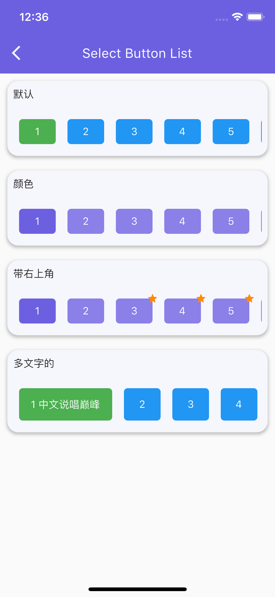

# flutter_cxui

一个新的flutter界面组件库，及flutter应用界面库。

## 组件预览

<!--  -->

 

|||
|--|--|
|||
|||
|||
|||

## 实例预览
|        |   |
| ----------- | ----------- |
|       |        |
 

## 感谢支持

**您的支持，是我持续输出的动力.**

<!--  -->

