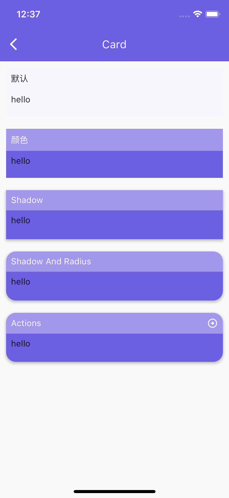

# flutter_cxui

<!-- flutter_cxui是一个基于Flutter框架的UI工具包，开发在Material框架下。它提供了丰富的可重用组件和样式， 它可以帮助开发者快速构建高性能、高保真度、高一致性的跨平台应用程序。 -->
flutter_cxui is a flutter ui kit with material theme. It includes a lot of reusable components and styles, it can help developers quickly build high-performance, high-correctness, and high-consistency applications.

## Install

```shell
  flutter pub add flutter_cxui
```

or

```yaml
dependencies:
  flutter_cxui: [version]
```

**Jump to [`Flutter_cxui`](https://pub.dev/packages/flutter_cxui) package.**

## Usage

`CxConfig` is custom class.

```Dart
import 'package:flutter_cxui/cxui.dart';

void main() {
  runApp(const MyApp());
}

class MyApp extends StatelessWidget {
  const MyApp({super.key});

  // This widget is the root of your application.
  @override
  Widget build(BuildContext context) {
    return MaterialApp(
      home: Scaffold(
        body:  CxCard(
          shadow: true,
          radius: 16,
          bgColor: CxConfig.primary,
          hdBgColor: CxConfig.white.withAlpha(90),
          titleColor: CxConfig.white,
          margin: EdgeInsets.all(10),
          title: "Actions",
          actions: [
            CxIconButton(
              icon: Icons.arrow_circle_right_outlined,
              color: CxConfig.white,
              size: 18,
            )
          ],
          body: Text("hello"),
        ),
      ),
    );
  }
}
```

## Components

<!--  -->

|||
|--|--|
|||
|||
|||
|||

## Demo

|        |   |
| ----------- | ----------- |
|      |  |

## Thanks for supporting us

<!--  -->

