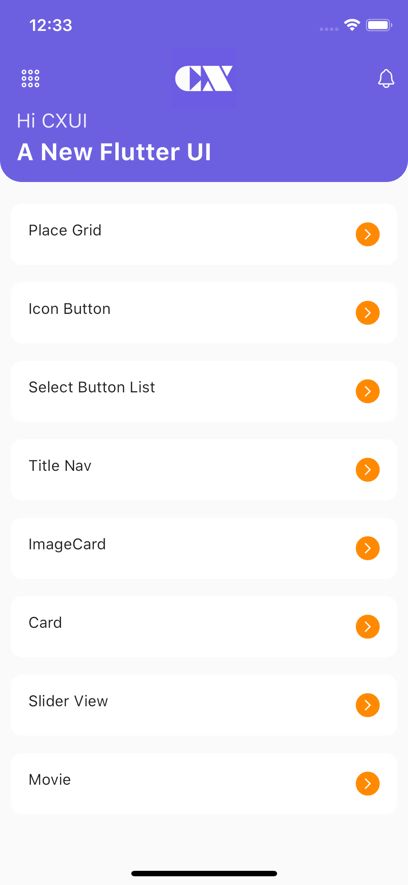
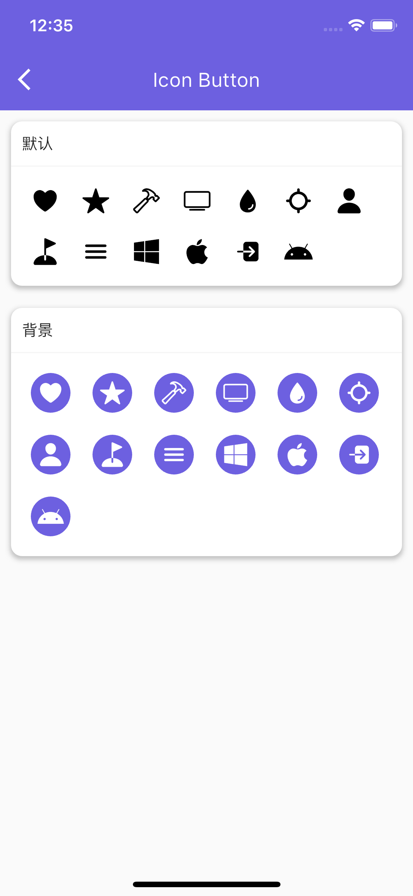
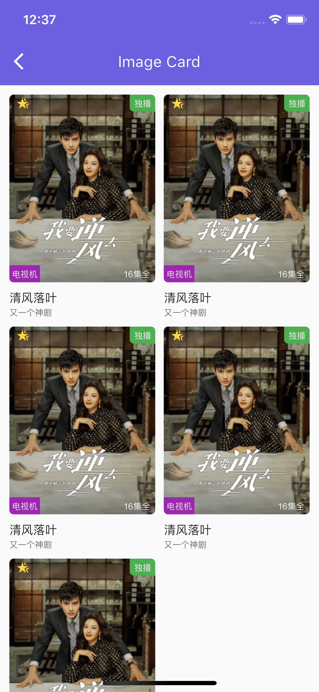

# flutter_cxui

一个新的flutter界面组件库，及flutter应用界面库。

## 使用

`CxConfig 是自定义的`

```Dart
import 'package:flutter_cxui/cxui.dart';

void main() {
  runApp(const MyApp());
}

class MyApp extends StatelessWidget {
  const MyApp({super.key});

  // This widget is the root of your application.
  @override
  Widget build(BuildContext context) {
    return MaterialApp(
      home: Scaffold(
        body:  CxCard(
          shadow: true,
          radius: 16,
          bgColor: CxConfig.primary,
          hdBgColor: CxConfig.white.withAlpha(90),
          titleColor: CxConfig.white,
          margin: EdgeInsets.all(10),
          title: "Actions",
          actions: [
            CxIconButton(
              icon: Icons.arrow_circle_right_outlined,
              color: CxConfig.white,
              size: 18,
            )
          ],
          body: Text("hello"),
        ),
      ),
    );
  }
}
```

## 组件预览

<!--  -->

 

|||
|--|--|
|||
|||
|||
|||


## 实例预览
|        |   |
| ----------- | ----------- |
|       |        |
 


## 感谢支持

**您的支持，是我持续输出的动力.**

<!--  -->

